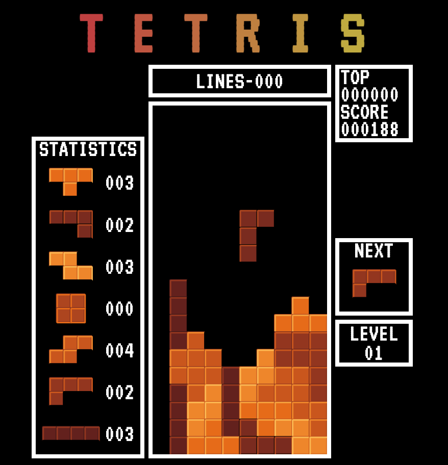

# Tetris

An NES Tetris clone built with Vite and TypeScript

## Images



## Commands

**Clone Repository**

```
git clone https://github.com/joe-gerhard/tetris.git
```

---

**Install Packages**

```
npm install
```

---

**Start Dev Server:**

```
npm run dev
```

---

**Build:**

```
npm run build
```
